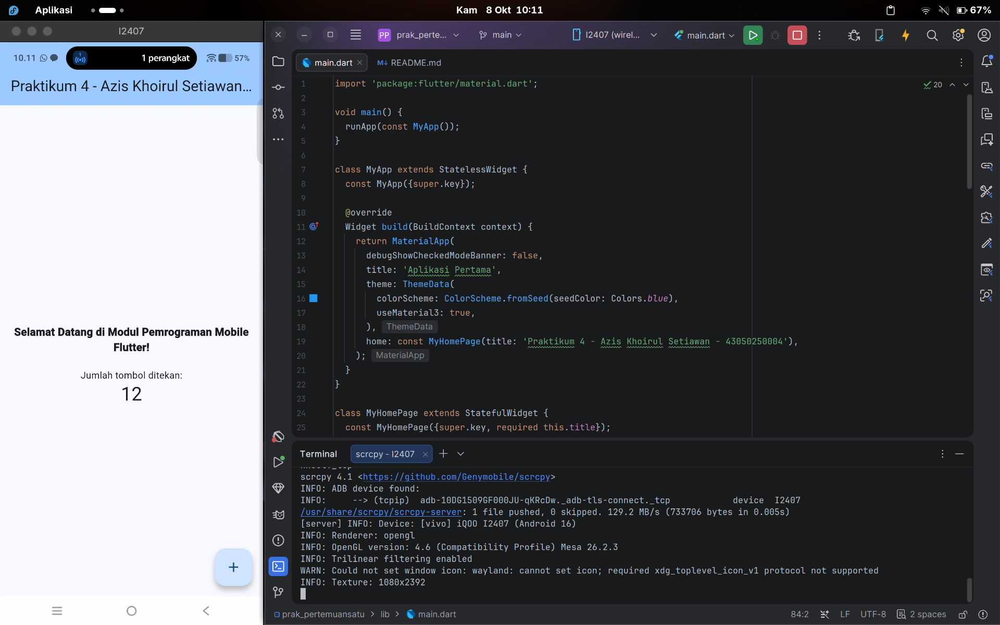
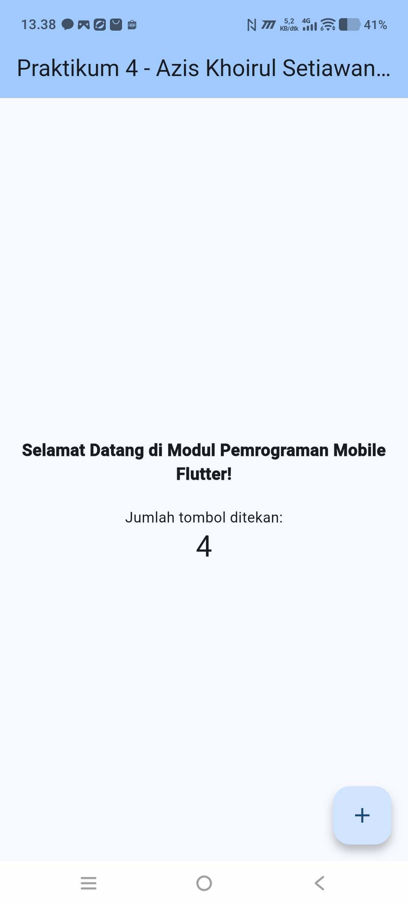

# Laporan Praktikum Pemrograman Mobile
## Modul 4: Pengenalan Flutter & Manajemen State Dasar

---

### Data Mahasiswa
* **Nama**: Azis Khoirul Setiawan
* **NIM**: 43050250004
* **Kelas**: 3A
* **Mata Kuliah**: Pemrograman Mobile

---

### 1. Tujuan Praktikum
* Memahami struktur dasar arsitektur proyek aplikasi Flutter.
* Mengenal hierarki komponen antarmuka (*Widget Tree*) menggunakan `StatelessWidget` dan `StatefulWidget`.
* Mengimplementasikan manajemen status lokal sederhana menggunakan fungsi `setState()`.
* Melakukan penyesuaian tema visual (*theming*) dan teks antarmuka aplikasi.
* Melakukan pengujian langsung pada perangkat fisik Android menggunakan koneksi nirkabel (Wireless ADB).

---

### 2. Dasar Teori & Pembahasan Kode
Aplikasi ini merupakan modifikasi dari *template* dasar Flutter (Counter App). Beberapa komponen utama yang dikonfigurasi:

* **MaterialApp & Theme**: Mengatur tema visual aplikasi dengan skema warna dasar biru (`Colors.blue`) dan mengaktifkan Material 3 (`useMaterial3: true`).
* **AppBar**: Menampilkan judul bilah atas yang disesuaikan menjadi format identitas mahasiswa: `Praktikum 4 - Azis Khoirul Setiawan - 43050250004`.
* **State Management**: Variabel counter bertambah nilainya secara dinamis setiap kali tombol aksi ditekan melalui pemanggilan method `setState()`.
* **FloatingActionButton**: Tombol melayang di pojok kanan bawah dengan ikon tambah (`Icons.add`) sebagai pemicu penambahan nilai counter.

---

### 3. Hasil Pengujian & Dokumentasi Antarmuka

Pengujian aplikasi dijalankan pada perangkat Android fisik (Vivo iQOO / I2407) melalui sambungan Wireless ADB dan ditampilkan secara langsung menggunakan `scrcpy`:

<p align="center">
  
  
</p>

*Keterangan gambar:*
1. **Sisi Kiri**: Lingkungan pengembangan Android Studio pada sistem operasi Linux (Fedora), menampilkan struktur kode `lib/main.dart`, konfigurasi tema biru, dan sesi aktif terminal `scrcpy`.
2. **Sisi Kanan**: Tangkapan layar antarmuka aplikasi pada layar ponsel, menunjukkan teks sambutan, judul bilah aplikasi dengan identitas mahasiswa, dan angka counter yang berhasil bertambah.

---

### 4. Struktur Percabangan (Git Branch)
* **`main`**: Berisi implementasi Modul 4 (Dasar Flutter, Counter App bertema biru, dan identitas mahasiswa).
* **`materi-5`**: Berisi implementasi Modul 5 (Autentikasi Login, Register, Form Validation, dan Dashboard).

---

### 5. Panduan Menjalankan Proyek
1. Beralih ke branch praktikum ini:
   ```bash
   git checkout main